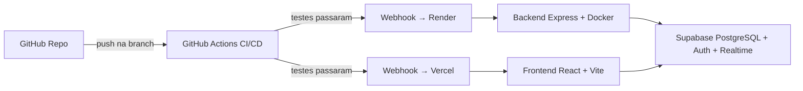

# 🚀 Guia: Colocando o Clone do SGP no Ar

Este guia cobre **tudo** que precisa ser feito para que alguém que clonou seu repositório consiga subir o projeto completo com a mesma infraestrutura (Supabase, Render, Vercel, GitHub Actions).

---

## 📋 Resumo da Arquitetura



> [!IMPORTANT]
> São **4 serviços** que precisam ser configurados manualmente. Infelizmente, **nenhum deles oferece uma API/CLI de setup totalmente automática** que crie o projeto do zero sem interação. Mas podemos **automatizar parcialmente** com scripts.

---

## 🔧 Passo a Passo Manual (O que DEVE ser feito)

### PASSO 1: Criar um novo projeto no Supabase

1. Acesse [supabase.com](https://supabase.com) → **New Project**
2. Escolha organização, nome e senha do banco
3. Após criação, vá em **Settings → API** e copie:
   - `Project URL` → será seu `SUPABASE_URL`
   - `anon public key` → será seu `SUPABASE_ANON_KEY`

4. Vá em **SQL Editor** e execute o SQL para criar as tabelas e políticas RLS:

```sql
-- Tabela de usuários
CREATE TABLE IF NOT EXISTS public.users (
  id UUID PRIMARY KEY REFERENCES auth.users(id),
  name TEXT NOT NULL,
  email TEXT NOT NULL UNIQUE,
  role TEXT NOT NULL DEFAULT 'Cliente',
  created_at TIMESTAMPTZ DEFAULT NOW()
);

-- Tabela de pedidos
CREATE TABLE IF NOT EXISTS public.orders (
  id UUID PRIMARY KEY DEFAULT gen_random_uuid(),
  user_id UUID NOT NULL REFERENCES public.users(id),
  description TEXT NOT NULL,
  status TEXT NOT NULL DEFAULT 'Pendente',
  created_at TIMESTAMPTZ DEFAULT NOW(),
  updated_at TIMESTAMPTZ DEFAULT NOW()
);

-- Tabela de histórico de status
CREATE TABLE IF NOT EXISTS public.status_history (
  id UUID PRIMARY KEY DEFAULT gen_random_uuid(),
  order_id UUID NOT NULL REFERENCES public.orders(id) ON DELETE CASCADE,
  old_status TEXT,
  new_status TEXT NOT NULL,
  changed_by UUID REFERENCES public.users(id),
  changed_at TIMESTAMPTZ DEFAULT NOW()
);

-- Habilitar RLS
ALTER TABLE public.orders ENABLE ROW LEVEL SECURITY;
ALTER TABLE public.status_history ENABLE ROW LEVEL SECURITY;
ALTER TABLE public.users ENABLE ROW LEVEL SECURITY;

-- Políticas RLS para orders
CREATE POLICY "Users can view own orders" ON public.orders
  FOR SELECT USING (auth.uid() = user_id);

CREATE POLICY "Admins can view all orders" ON public.orders
  FOR SELECT USING (
    EXISTS (SELECT 1 FROM public.users WHERE id = auth.uid() AND role = 'Administrador')
  );

CREATE POLICY "Users can insert own orders" ON public.orders
  FOR INSERT WITH CHECK (auth.uid() = user_id);

CREATE POLICY "Users can update own pending orders" ON public.orders
  FOR UPDATE USING (auth.uid() = user_id AND status = 'Pendente');

CREATE POLICY "Admins can update any order" ON public.orders
  FOR UPDATE USING (
    EXISTS (SELECT 1 FROM public.users WHERE id = auth.uid() AND role = 'Administrador')
  );

CREATE POLICY "Users can delete own pending orders" ON public.orders
  FOR DELETE USING (auth.uid() = user_id AND status = 'Pendente');

-- Políticas RLS para status_history
CREATE POLICY "Users can view own order history" ON public.status_history
  FOR SELECT USING (
    EXISTS (SELECT 1 FROM public.orders WHERE id = order_id AND user_id = auth.uid())
  );

CREATE POLICY "Admins can view all history" ON public.status_history
  FOR SELECT USING (
    EXISTS (SELECT 1 FROM public.users WHERE id = auth.uid() AND role = 'Administrador')
  );

CREATE POLICY "Admins can insert history" ON public.status_history
  FOR INSERT WITH CHECK (
    EXISTS (SELECT 1 FROM public.users WHERE id = auth.uid() AND role = 'Administrador')
  );

-- Políticas RLS para users
CREATE POLICY "Users can view own profile" ON public.users
  FOR SELECT USING (auth.uid() = id);

CREATE POLICY "Admins can view all users" ON public.users
  FOR SELECT USING (
    EXISTS (SELECT 1 FROM public.users WHERE id = auth.uid() AND role = 'Administrador')
  );

CREATE POLICY "Users can insert own profile" ON public.users
  FOR INSERT WITH CHECK (auth.uid() = id);

-- Habilitar Realtime na tabela orders
ALTER PUBLICATION supabase_realtime ADD TABLE public.orders;
```

> [!NOTE]
> O SQL acima é uma **reconstrução baseada** na estrutura do projeto. Verifique se o schema real do seu projeto original tem diferenças e ajuste conforme necessário. Se você já possui um dump SQL exportado do Supabase original, use-o em vez deste.

5. *(Opcional)* Vá em **Authentication → URL Configuration** e configure os redirect URLs se necessário.

---

### PASSO 2: Deploy do Backend na Render

1. Acesse [render.com](https://render.com) → **New → Web Service**
2. Conecte seu repositório GitHub
3. Configure:
   | Campo | Valor |
   |---|---|
   | **Name** | `sgp-backend-api` (ou o nome que quiser) |
   | **Root Directory** | `backend` |
   | **Environment** | `Docker` |
   | **Branch** | `setup-infraestrutura` (ou `main`) |

4. Adicione as variáveis de ambiente:
   | Key | Value |
   |---|---|
   | `PORT` | `3000` |
   | `SUPABASE_URL` | A URL do passo 1 |
   | `SUPABASE_ANON_KEY` | A chave do passo 1 |

5. Após criar, vá em **Settings → Deploy Hook** e copie a URL do webhook — será usada depois.
6. Anote a URL pública do serviço (ex: `https://sgp-backend-api.onrender.com`)

---

### PASSO 3: Deploy do Frontend na Vercel

1. Acesse [vercel.com](https://vercel.com) → **Add New → Project**
2. Importe o repositório GitHub
3. Configure:
   | Campo | Valor |
   |---|---|
   | **Root Directory** | `frontend` |
   | **Framework Preset** | `Vite` |
   | **Build Command** | `npm run build` |
   | **Output Directory** | `dist` |

4. Adicione as variáveis de ambiente:
   | Key | Value |
   |---|---|
   | `VITE_SUPABASE_URL` | A URL do Supabase |
   | `VITE_SUPABASE_ANON_KEY` | A chave anon do Supabase |
   | `VITE_API_BASE_URL` | A URL do backend no Render (do passo 2) |

5. Vá em **Settings → Git → Deploy Hooks** e crie um hook para a branch desejada. Copie a URL.

---

### PASSO 4: Configurar GitHub Actions (Secrets)

1. No GitHub, vá em **Settings → Secrets and variables → Actions**
2. Adicione os seguintes **Repository Secrets**:

   | Secret | Value |
   |---|---|
   | `RENDER_DEPLOY_HOOK` | URL do Deploy Hook do Render (passo 2) |
   | `VERCEL_DEPLOY_HOOK` | URL do Deploy Hook da Vercel (passo 3) |

3. **Ajustar a branch no workflow** — atualmente o pipeline monitora a branch `setup-infraestrutura`. Se você quiser usar `main`:

```diff
# .github/workflows/deploy.yml
  on:
    push:
      branches:
-       - setup-infraestrutura
+       - main
    pull_request:
      branches:
-       - setup-infraestrutura
+       - main

  ...

-   if: github.ref == 'refs/heads/setup-infraestrutura'
+   if: github.ref == 'refs/heads/main'
```

---

## 🤖 O que pode ser automatizado?

| Etapa | Automatizável? | Como |
|---|---|---|
| **Supabase: Criar projeto** | ⚠️ Parcial | A [Supabase CLI](https://supabase.com/docs/guides/cli) permite `supabase link` e `supabase db push` para migrar o schema, **mas a criação do projeto em si é manual no dashboard** |
| **Supabase: Schema/Migrations** | ✅ Sim | Exportar com `supabase db dump` e aplicar com `supabase db push`. Pode virar um script! |
| **Render: Criar serviço** | ⚠️ Parcial | Render tem uma [Blueprint (render.yaml)](https://render.com/docs/infrastructure-as-code) que permite definir a infraestrutura como código |
| **Vercel: Criar projeto** | ✅ Sim | Vercel CLI: `vercel link` + `vercel env add` + `vercel deploy` |
| **GitHub Secrets** | ✅ Sim | GitHub CLI: `gh secret set RENDER_DEPLOY_HOOK` |
| **Tudo junto via script** | ⚠️ Parcial | Um script shell pode encadear tudo, mas exige login prévio em cada CLI |

---

## 📦 Automação Parcial: Arquivos de Infraestrutura como Código

Abaixo estão os arquivos que você pode adicionar ao repositório para facilitar a vida de quem clonar:

### 1. `render.yaml` (Infrastructure as Code para o Render)

Coloque na **raiz** do repositório:

```yaml
# render.yaml - Blueprint para deploy automático no Render
services:
  - type: web
    name: sgp-backend-api
    runtime: docker
    dockerfilePath: ./backend/Dockerfile
    dockerContext: ./backend
    branch: main
    envVars:
      - key: PORT
        value: "3000"
      - key: SUPABASE_URL
        sync: false  # Precisa ser preenchido manualmente
      - key: SUPABASE_ANON_KEY
        sync: false  # Precisa ser preenchido manualmente
    healthCheckPath: /health
```

> Com esse arquivo, no Render você pode ir em **Blueprints → New Blueprint Instance** e ele cria o serviço automaticamente, pedindo apenas as variáveis marcadas como `sync: false`.

### 2. `supabase/migrations/` (Migrations do Schema)

Para habilitar, rode localmente:

```bash
# Instalar Supabase CLI
npm install -g supabase

# Inicializar (na raiz do projeto)
supabase init

# Linkar ao projeto existente
supabase link --project-ref SEU_PROJECT_REF

# Exportar o schema atual como migration
supabase db dump -f supabase/migrations/001_initial_schema.sql
```

Depois, quem clonar pode aplicar com:

```bash
supabase link --project-ref SEU_PROJECT_REF
supabase db push
```

### 3. Script de Setup (`scripts/setup-deploy.sh`)

Um script que encadeia os passos de CLI:

```bash
#!/bin/bash
set -e

echo "🚀 SGP - Setup de Deploy"
echo "========================"
echo ""

# 1. Verificar CLIs instaladas
echo "📋 Verificando ferramentas necessárias..."
command -v gh >/dev/null 2>&1 || { echo "❌ GitHub CLI (gh) não encontrado. Instale: https://cli.github.com/"; exit 1; }
command -v vercel >/dev/null 2>&1 || { echo "❌ Vercel CLI não encontrado. Instale: npm i -g vercel"; exit 1; }
command -v supabase >/dev/null 2>&1 || { echo "❌ Supabase CLI não encontrado. Instale: npm i -g supabase"; exit 1; }

# 2. Coletar variáveis
read -p "🔑 SUPABASE_URL: " SUPABASE_URL
read -p "🔑 SUPABASE_ANON_KEY: " SUPABASE_ANON_KEY
read -p "🔑 URL do Backend no Render (ex: https://sgp-backend-api.onrender.com): " BACKEND_URL
read -p "🔑 RENDER_DEPLOY_HOOK URL: " RENDER_HOOK
read -p "🔑 VERCEL_DEPLOY_HOOK URL: " VERCEL_HOOK

# 3. Configurar GitHub Secrets
echo ""
echo "🔐 Configurando GitHub Secrets..."
gh secret set RENDER_DEPLOY_HOOK --body "$RENDER_HOOK"
gh secret set VERCEL_DEPLOY_HOOK --body "$VERCEL_HOOK"
echo "✅ Secrets configurados!"

# 4. Deploy do Frontend na Vercel
echo ""
echo "🌐 Configurando Vercel..."
cd frontend
vercel link
vercel env add VITE_SUPABASE_URL production <<< "$SUPABASE_URL"
vercel env add VITE_SUPABASE_ANON_KEY production <<< "$SUPABASE_ANON_KEY"
vercel env add VITE_API_BASE_URL production <<< "$BACKEND_URL"
vercel deploy --prod
cd ..

echo ""
echo "✅ Setup completo!"
echo ""
echo "📌 Lembrete: O backend no Render precisa ser criado manualmente"
echo "   ou via Blueprint (render.yaml). Configure as env vars:"
echo "   - PORT=3000"
echo "   - SUPABASE_URL=$SUPABASE_URL"
echo "   - SUPABASE_ANON_KEY=<sua_key>"
```

---

## ✅ Checklist Final

Após configurar tudo, valide com este checklist:

- [ ] **Supabase**: Projeto criado, tabelas/RLS/Realtime configurados
- [ ] **Render**: Backend rodando, health check OK em `GET /health`
- [ ] **Vercel**: Frontend acessível, login/registro funcionando
- [ ] **GitHub Actions**: Secrets `RENDER_DEPLOY_HOOK` e `VERCEL_DEPLOY_HOOK` configurados
- [ ] **Pipeline**: Fazer um push e verificar se o workflow roda com sucesso
- [ ] **Testar fluxo**: Criar conta → Fazer pedido → Admin atualizar status → Verificar realtime

---

## 🎯 Conclusão

| Pergunta | Resposta |
|---|---|
| **É possível colocar no ar a partir do clone?** | ✅ Sim, totalmente |
| **É 100% automatizável?** | ❌ Não. A criação de projetos no Supabase e Render exige interação manual no dashboard |
| **Dá para automatizar boa parte?** | ✅ Sim! Com `render.yaml` + Supabase Migrations + Vercel CLI + GitHub CLI, o trabalho manual cai para ~15 minutos |
| **Precisa pagar algo?** | Todos os serviços têm **plano gratuito** suficiente para o projeto |
