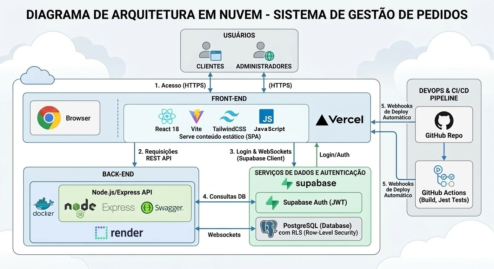

# Relatório Técnico — Sistema de Gestão de Pedidos (SGP)

---

## 1. Visão Geral do Sistema

O **SGP (Sistema de Gestão de Pedidos)** é uma aplicação web full-stack construída em arquitetura **Monorepo**, projetada para gerenciar o ciclo de vida completo de pedidos — desde a criação pelo cliente até a entrega final controlada por um administrador.

### Funcionalidades Principais

| Funcionalidade | Cliente | Administrador |
|---|---|---|
| Criar conta (auto-registro) | ✅ | ✅ (via Supabase) |
| Criar novo pedido | ✅ | ❌ |
| Editar pedido (status "Pendente") | ✅ | ❌ |
| Excluir/Cancelar pedido (status "Pendente") | ✅ | ❌ |
| Visualizar próprios pedidos | ✅ | ✅ (todos) |
| Alterar status do pedido | ❌ | ✅ |
| Acompanhamento em tempo real | ✅ | ✅ |

### Fluxo de Status dos Pedidos
```
Pendente → Em Preparo → Enviado → Entregue
```
Cada transição de status gera um registro automático na tabela `status_history`, garantindo rastreabilidade completa.

### Estrutura do Monorepo
```
sistema-de-pedidos/
├── frontend/          # React + Vite (Hospedado na Vercel)
├── backend/           # Node.js + Express (Hospedado na Render)
├── .github/workflows/ # Pipeline CI/CD (GitHub Actions)
└── README.md          # Documentação geral
```

---

## 2. Tecnologias e Serviços Utilizados

### Frontend
| Tecnologia | Finalidade |
|---|---|
| **React 18** | Biblioteca de UI para construção de componentes reativos |
| **Vite** | Bundler ultrarrápido de próxima geração para desenvolvimento e build |
| **Tailwind CSS** | Framework de estilização utility-first para design responsivo |
| **Shadcn UI** | Biblioteca de componentes acessíveis (Dialog, Tabs, Cards, Select, etc.) |
| **Lucide React** | Conjunto de ícones modernos e leves (Edit, Trash, Plus) |
| **React Router DOM** | Navegação client-side entre páginas (SPA) |
| **Supabase Client** | SDK para autenticação e subscrição em tempo real via WebSockets |

### Backend
| Tecnologia | Finalidade |
|---|---|
| **Node.js** | Runtime JavaScript server-side |
| **Express.js** | Framework web para criação de APIs RESTful |
| **Supabase (PostgreSQL)** | Banco de dados relacional com Row-Level Security (RLS) |
| **Supabase Auth** | Autenticação baseada em JWT com gerenciamento de sessões |
| **Swagger (swagger-jsdoc + swagger-ui-express)** | Documentação interativa da API (OpenAPI 3.0) |
| **Jest + Supertest** | Framework de testes automatizados para validação de endpoints |

### Infraestrutura e DevOps
| Serviço | Finalidade |
|---|---|
| **GitHub** | Versionamento de código e repositório central |
| **GitHub Actions** | Pipeline de CI/CD automatizada |
| **Vercel** | Hospedagem do frontend (CDN global, builds automáticos) |
| **Render** | Hospedagem do backend (Container Docker, deploy via Webhook) |
| **Docker** | Containerização do backend para deploy consistente |

---

## 3. Estratégia de Deploy e CI/CD

### Pipeline Automatizada (GitHub Actions)

O arquivo `.github/workflows/deploy.yml` define o fluxo completo de integração e entrega contínua:

```
Push na branch "setup-infraestrutura"
        │
        ▼
┌─────────────────────────┐
│  Job 1: test-and-build  │
│  • Checkout do código   │
│  • Setup Node.js 18     │
│  • npm ci (backend)     │
│  • npm test (Jest)      │
└──────────┬──────────────┘
           │ ✅ Testes passaram
           ▼
┌─────────────────────────┐
│  Job 2: webhook-deploy  │
│  • curl → Render Hook   │
│  • curl → Vercel Hook   │
└─────────────────────────┘
```

### Detalhes por Ambiente

**Frontend (Vercel)**:
- Branch monitorada: `setup-infraestrutura`
- Root Directory configurado: `frontend/`
- Arquivo `vercel.json` com rewrite para SPA (todas as rotas redirecionam para `index.html`)
- Variáveis de ambiente: `VITE_SUPABASE_URL`, `VITE_SUPABASE_ANON_KEY`, `VITE_API_BASE_URL`

**Backend (Render)**:
- Deploy via `Dockerfile` na pasta `backend/`
- Variáveis de ambiente: `PORT`, `SUPABASE_URL`, `SUPABASE_ANON_KEY`
- Health check endpoint: `GET /health`

### Segurança dos Webhooks
Os URLs dos Deploy Hooks são armazenados como **GitHub Secrets** (`RENDER_DEPLOY_HOOK` e `VERCEL_DEPLOY_HOOK`), nunca expostos no código-fonte.

---

## 4. Dificuldades Encontradas e Soluções Adotadas

### 4.1 — Página em Branco na Vercel (Tela Padrão do Vite)
- **Problema**: Após o primeiro deploy, a Vercel exibia apenas a página padrão do Vite ao invés da aplicação React.
- **Causa**: O código do frontend (React Router, componentes) ainda não havia sido mesclado na branch `setup-infraestrutura` que a Vercel monitorava.
- **Solução**: Merge de todas as feature branches para a branch principal de deploy e criação do arquivo `vercel.json` com regra de rewrite para garantir o roteamento correto da SPA.

### 4.2 — Erro de RLS na Criação de Pedidos (`new row violates row-level security policy`)
- **Problema**: O cliente conseguia se autenticar, mas ao criar um pedido a API retornava erro 403 do PostgreSQL.
- **Causa**: O backend utilizava um cliente Supabase inicializado com a `ANON_KEY` (anônima), sem repassar o JWT do usuário autenticado. O Supabase não conseguia identificar o `auth.uid()` nas políticas RLS.
- **Solução (Arquitetural)**: Criação de uma factory function `getAuthClient(token)` no módulo `supabaseClient.js` que instancia um cliente Supabase autenticado com o Bearer Token do usuário. O middleware `auth.js` passou a injetar `req.supabase` com este cliente autenticado em cada requisição, permitindo que o RLS funcione corretamente.

### 4.3 — Políticas RLS Incompletas (Update/Delete Bloqueados)
- **Problema**: Após corrigir o INSERT, as operações de UPDATE e DELETE ainda falhavam com erro de RLS.
- **Causa**: O script SQL inicial criou apenas a política de INSERT. Quando o usuário tentou rodar o script completo com todas as políticas, a primeira (`INSERT`) já existia, causando um erro que abortava a execução das demais.
- **Solução**: Execução separada apenas das políticas faltantes (UPDATE e DELETE para `orders`, e DELETE para `status_history`), além de criação de políticas específicas para o papel Administrador.

### 4.4 — Falha no CI/CD: URL Inválida no Ambiente de Testes
- **Problema**: O pipeline do GitHub Actions falhava na etapa de testes Jest com o erro `"Invalid supabaseUrl: Must be a valid HTTP or HTTPS URL"`.
- **Causa**: O fallback `'dummy-url'` usado quando não há arquivo `.env` não era uma URL HTTP válida. Versões recentes do `@supabase/supabase-js` passaram a validar rigorosamente o formato da URL.
- **Solução**: Substituição do fallback para `'https://dummy-url.supabase.co'`, uma URL sintaticamente válida que permite a inicialização do cliente sem erros, mesmo sem conexão real com o banco.

### 4.5 — Swagger Vazio no Ambiente de Produção
- **Problema**: A página `/api-docs` no servidor Render não exibia nenhuma rota documentada.
- **Causa**: O caminho `'./src/routes/*.js'` usado pelo `swagger-jsdoc` era relativo ao diretório de trabalho (CWD), que difere entre ambientes locais e containers Docker.
- **Solução**: Uso de `path.join(__dirname, 'routes/*.js')` para resolver o caminho de forma absoluta, independente do ambiente de execução.


## 5. Diagrama de Arquitetura em Nuvem 

Abaixo está a representação visual da arquitetura do Sistema de Gestão de Pedidos (SGP), ilustrando a integração entre os serviços de nuvem, o ambiente de contêineres e o pipeline de CI/CD:




## 6. Formação da Equipe e Responsabilidades

| Integrante | Papel Técnico |
| :--- | :--- |
| **Erycles de Sousa** | Arquiteto(a) de Software em Nuvem |
| **Sérgio Brener da Silva Evangelista** | Desenvolvedor(a) Back-end |
| **Lucas Bastos do Nascimento** | Desenvolvedor(a) Front-end |
| **Felipe Yash Lemos Patwardhan** | Engenheiro(a) DevOps |
| **Thiago Verçosa Soares** | Responsável por Qualidade e Testes |
| **Fabio Arimateia Gomes** | Documentação e Integração |

### Detalhamento das Contribuições

* **Erycles de Sousa (Arquiteto de Software em Nuvem):** Responsável pelo desenho da topologia da solução em nuvem e seleção dos provedores de serviço (Vercel, Render e Supabase).
* **Sérgio Brener da Silva Evangelista (Desenvolvedor Back-end):** Implementou a API RESTful e estruturou o ambiente de containers com Docker.
* **Lucas Bastos do Nascimento (Desenvolvedor Front-end):** Desenvolveu a interface em React e garantiu a integração com os serviços de nuvem.
* **Felipe Yash Lemos Patwardhan (Engenheiro DevOps):** Estruturou o pipeline de CI/CD via GitHub Actions e gerenciou os deploys automatizados.
* **Thiago Verçosa Soares (Responsável por Qualidade e Testes):** Implementou os testes automatizados de API com Jest e Supertest.
* **Fabio Arimateia Gomes (Documentação e Integração):** Responsável pela documentação Swagger e redação do relatório técnico.
